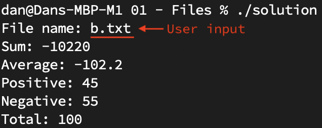

# Homework 1: Files

2022-07-30

In this homework, you will write a program that will read all numbers from a file, then print the **sum**, **average**, the **amount of positive numbers**, the **amount of negative numbers**, and the **amount of all numbers** (both positive and negative).

Your program should do the following:

1. Ask the user for a file to open.
2. Open the file.
3. If the file did not open, warn the user and exit the program.
4. Process every number in the file.
5. Close the file.
6. Print the sum, average, count of positive numbers, count of negative numbers, and count of all numbers.
7. Exit.



To write this program, you will need to use everything you have learned so far:

* Loops
* If/else
* Simple math
* Variables
* Input and output (cin and cout)

You will also need to learn two new things:

* Files
* Error messages

## Files

Reading numbers from files is as easy as reading them from the terminal.

First, include the standard library for working with files.

```.cpp
#include <fstream>
```

Second, open a file to read from it.

```.cpp
ifstream fin("filename.txt");

if (!fin)
{
  cerr << "Unable to open file: filename.txt" << endl;
  exit(1);
}
```

Third, read numbers from a file until there are no more numbers.

```.cpp
int number;

// This loop will run until the end of the file
while (fin >> number)
{
  // process number
}
```

Finally, close the file. This is important! Every file you open must be closed so that other programs can use it.

```.cpp
fin.close();
```

## Errors

Sometimes the programs we write will have errors. This is normal, and it is OK! When this happens, tell the user and close the program safely.

To tell the user about an error, print a message to `cerr` instead of `cout`. In C++, `cerr` is the standard place to send error messages.

```.cpp
cerr << "ERROR! Unable to open file: filename.txt" << endl;
```

When an error occurs, call `exit(1)` to end your program immediately.

```.cpp
if (/* an error occurred */)
{
  exit(1);
}
```

If you want to end your program early when no error occurred, you can use `exit(0)`. However, you will not need to do this for this homework.

## Calculating the Average

The average of some numbers equals the sum of those numbers divided by the amount of numbers. `average = sum / count`.

Example:

```
int a = 5;
int b = 7;
int c = 1;
int d = 10;
int e = 9;

int count = 5;

int sum = a + b + c + d + e; // = 32

int average = sum / count;   // = 6.4
```

## Instructions

Test your program using the example files I've given you. Your program's answers should match the corresponding solution file.

Data file | Solution file
----------|---------------
a.txt     | a_solution.txt
b.txt     | b_solution.txt
c.txt     | c_solution.txt
d.txt     | d_solution.txt

Take as much time as you need. I think this program can be finished in 2 days. If it takes more time, don't worry, you are learning!

When you are done, you can send me your program code (`.cpp` file). I will read it and test it, then you and I will discuss it.

Please ask me any questions you have. If you get stuck, do not be embarassed or sad; talk to me, and we will work through it together. 

You are welcome to look up information online: it is not cheating! Programmers look up examples, tutorials, videos, and documents often! Here are some web pages that might help:

* [CPlusPlus.com: Input/ouptut with files](https://cplusplus.com/doc/tutorial/files/)
* [Programiz.com: C++ cerr](https://www.programiz.com/cpp-programming/library-function/iostream/cerr)
* [CppHindiTutorials.com: exit statement in C++ with example](https://cpphinditutorials.com/dev-cpp/exit-statement-in-cpp-with-example/)